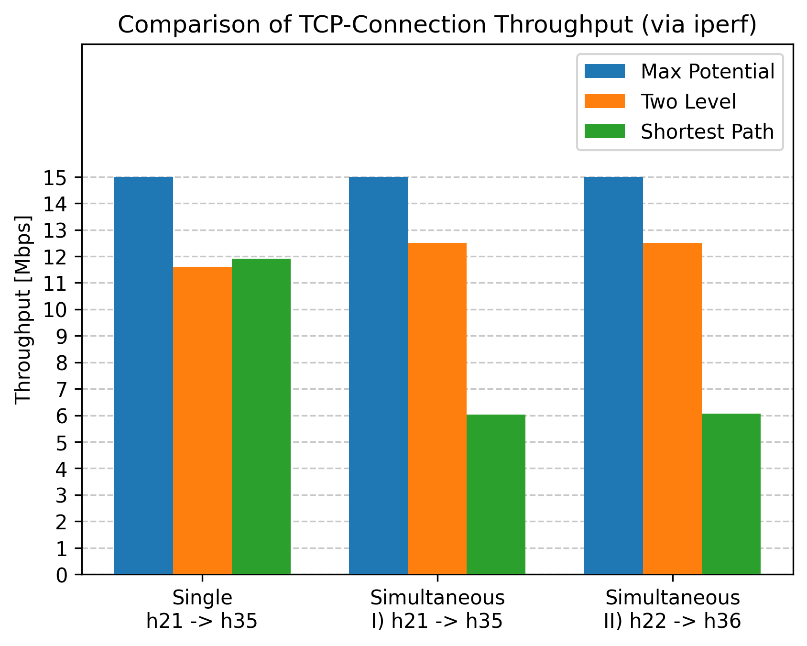
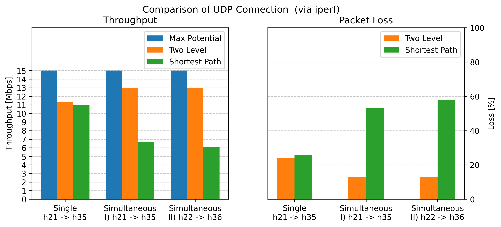

# Explanation of our Experiment

### Idea
In shortest path routing the path between two edge switches in different pods is always the same, no matter which of the adjacent hosts try to communicate with each other. This path then needs to be shared between the communication flows, effectively splitting the available bandwidth among them.  
In two-level routing this is not the case, as traffic is diffused based on the target host's id, so the traffic between two edge switches in different pods does not take the same route, as long as it is not destined to the same host.  
This is why we decided to establish simultanous communication between the leftmost (`h21`, `h22`) and the rightmost (`h35`, `h36`) pairs of hosts, measuring the throughput for TCP and UDP via `iperf`. For additional comparison we also measured the thrughput for just one pair of hosts out of these two groups. More details on how we did that follow in the next section.

### Setup and Execution 
The code for our experiment is located in `./fat-tree.py` and only executed for 4-port switches, as it depends on specific host names.  
To get to our results, we once set up the controller for two-level-routing and executed the network for that, writing the results to the file `./artifacts/ft_results.txt`. Then we adapted the output file to `./artifacts/sp_results.txt` and ran the network again with the controller for shortest path routing.  
>**WARNING:** The filename of the experiments output file denoted in `./fat-tree.py` **MUST** fit the controller that has been started. Otherwise the results will not be assigned correctly. 
The experiement itself is executed twice (once for TCP and once for UDP) and consists of 2 Stages:
1. `h21` listenes to `h35`
2. `h21` listenes to `h35` and, at the same time, `h22` listenes to `h36`

After collecting these results, we wrote and ran the script `./analyse_experiment.py`, which parses the relevant data from the `.txt`-files and generates the plots `./artifacts/tcp_comparison.png` and `./artifacts/udp_comparison.png` to better visualise the difference. These will be discussed briefly in the next section

### Results

As we can see, neither two-level routing nor shortest-path routing can max out the given link rate in any case.  
For a single ongoing communication they behave rather similar in terms of throughput (and for UDP also packet loss), which is to be expected as there are no bottlenecks.  
But for simultaneous communication the throughput (both with TCP and UDP) of two-level routing stays the same, or even improves, while the throughput of shortest path routing degrades significantly. The bandwidth clearly gets split among the two flows.  
When looking at packet loss in the case of UDP, the bottleneck in shortest path routing leads to roughly every second packet getting dropped, while two-level routing shows even less packet loss than in the single communication case.

